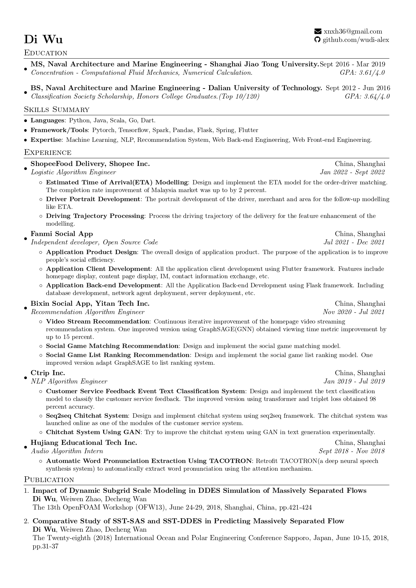

### Hi there 👋, this is Di Wu's homepage.
### Now I am a PH.D. candidate in Sunlab at George Mason University, advised by Prof.Kun Sun.
### My research interest is about code generation using LLM.
### Below is my experience.
<!--
**wudi-alex/wudi-alex** is a ✨ _special_ ✨ repository because its `README.md` (this file) appears on your GitHub profile.

Here are some ideas to get you started:

- 🔭 I’m currently working on ...
- 🌱 I’m currently learning ...
- 👯 I’m looking to collaborate on ...
- 🤔 I’m looking for help with ...
- 💬 Ask me about ...
- 📫 How to reach me: ...
- 😄 Pronouns: ...
- ⚡ Fun fact: ...
-->
